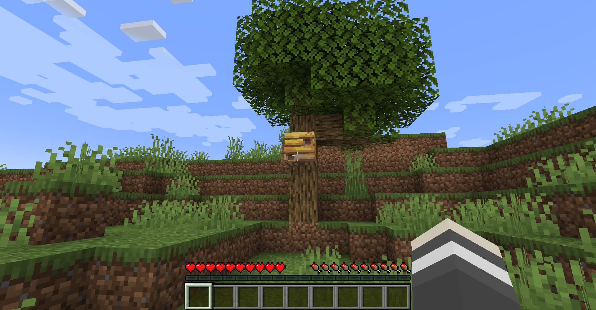
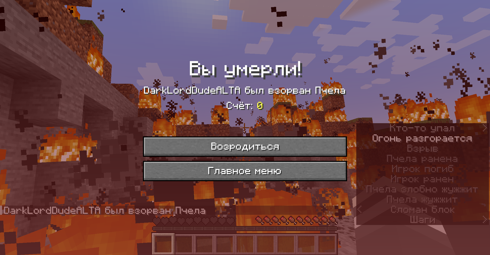

# Incendiary Bees

*High Ordinance Apioforms*

A data pack for Minecraft 1.19 (but will probably work with 1.15+) that causes bees to ***carpet bomb*** your world when agitated!

## Configuration

You can configure the amount of ticks between the dropping of each bee bomb with the following command, defaults to 15:

```text
/scoreboard players set bee_bomb_cooldown incndrybs <ticks>
```

You can configure the bee bomb explosion power with the following command, defaults to 10:

```text
/scoreboard players set bee_bomb_power incndrybs <explosion power>
```

## Installation

Grab a version from [RELEASES](https://github.com/ona-li-toki-e-jan-Epiphany-tawa-mi/Incendiary-Bees/releases "Incendiary Bees Releases Page") and place it inside your world's datapacks folder. [See for more information.](https://minecraft.fandom.com/wiki/Tutorials/Installing_a_data_pack "A Minecraft Wiki tutorial on installing data packs")

The pack will automatically finish installation on world load, but you can force it using (recommended if updating pack, note: resets configurations):

```text
/function incndrybs:install/initialize
```

## Uninstallation

To uninstall, you first need to run this command:

```text
/function incndrybs:install/uninstall
```

After that, remove the datapack from your world's datapacks folder before reloading.

## Links

- [Plannet Minecraft page](https://www.planetminecraft.com/data-pack/incendiary-bees "Incendiary Bees' page on Planet Minecraft")
- [Demonstration Video](https://www.youtube.com/watch?v=FldGUMvSmdo "Incendiary Bees demonstration video on YouTube")

## Screenshots


